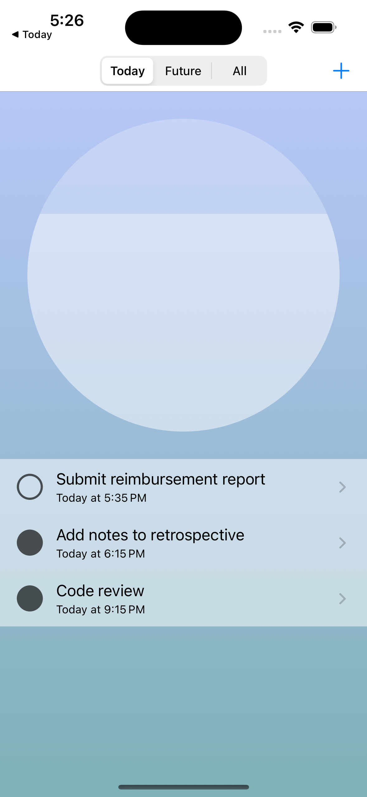
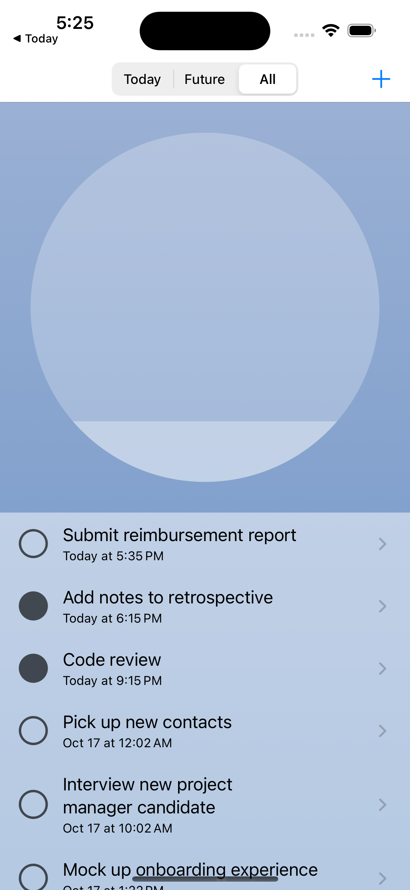
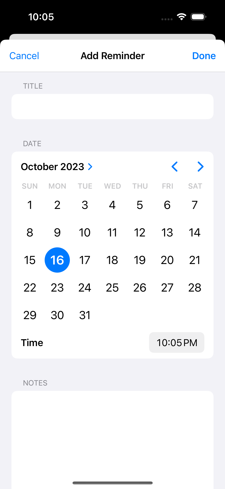

# Today - A Daily Productivity App

## Overview

"Today" is a sleek productivity app developed as part of my hands-on journey through [Apple's Official Developer Tutorials](https://developer.apple.com/tutorials/app-dev-training/getting-started-with-today). This iOS app is designed to assist users in organizing their day-to-day tasks with an added touch of calm aesthetics and smooth animations.

### Features

- **Reminder List**: Today starts with a list of tasks, allowing users to gain an overview of their reminders. With intuitive categories like 'Today,' 'Future,' and 'All,' users can seamlessly navigate through their tasks. The progress circle dynamically updates, offering users a satisfying visual representation of their productivity.
  
  

- **Detailed Reminders**: Users can delve into each reminder for more information, including title, due date, time, and additional notes. The app provides an 'Edit' mode for users to easily update their reminder's details.
  
  

- **Add Reminders**: A user-friendly interface for adding new reminders ensures that keeping track of tasks is just a tap away. This feature reuses cells from the 'Edit' view, providing a consistent user experience.
  
  

## Key Learning Areas

During the development of "Today," I immersed myself in various iOS development topics and techniques:

1. **Adopting Collection Views**: Learned the efficient management and customization of data collections with `UICollectionView`, enhancing the app's scalability and maintainability.

2. **Displaying Collections**: Explored the flexible organization of collection view cells into different sections, optimizing data presentation and user navigation.

3. **Integration with EventKit**: Delved into the `EventKit` framework to enable interaction with users' calendar events and reminders, allowing for data sharing between the Reminders app and "Today."

4. **Custom Views & Animations**: Crafted custom views, including a progress tracking view, using UIKit. Grasped the essentials of creating dynamic visuals and ensuring their accessibility.

5. **Accessibility in UIKit**: Gained insights into making UI elements accessible, understanding the roles of labels, values, actions, and traits in enhancing app accessibility.
